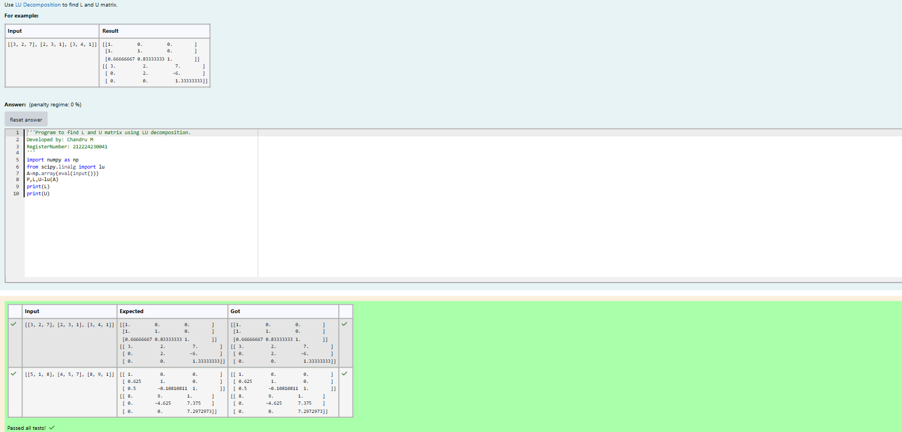
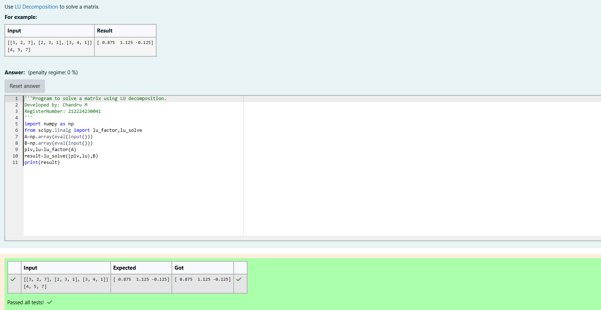

# LU Decomposition 

## AIM:
To write a program to find the LU Decomposition of a matrix.

## Equipments Required:
1. Hardware – PCs
2. Anaconda – Python 3.7 Installation / Moodle-Code Runner

## Algorithm

1.Import numpy

2.From scipy.linalg import lu,lu_factor,lu_solve respectively

3.Get the input of matrix values from user using eval

4.Print and solce LU decomposition using lu_solve() function 

## Program:
(i) To find the L and U matrix
```python
Program to find L and U matrix using LU decomposition.
Developed by: Chandru M 
RegisterNumber: 212224230041
import numpy as np
from scipy.linalg import lu
A=np.array(eval(input()))
P,L,U=lu(A)
print(L)
print(U)
```
(ii) To find the LU Decomposition of a matrix
```python
Program to solve a matrix using LU decomposition.
Developed by: Chandru M
RegisterNumber: 212224230041
import numpy as np
from scipy.linalg import lu_factor,lu_solve
A=np.array(eval(input()))
B=np.array(eval(input()))
piv,lu=lu_factor(A)
result=lu_solve((piv,lu),B)
print(result)
```

## Output:





## Result:
Thus the program to find the LU Decomposition of a matrix is written and verified using python programming.

